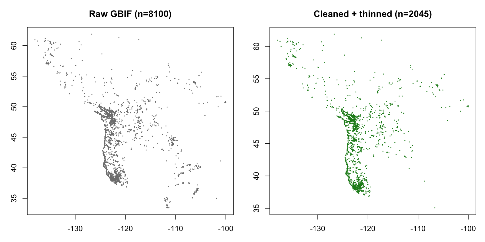
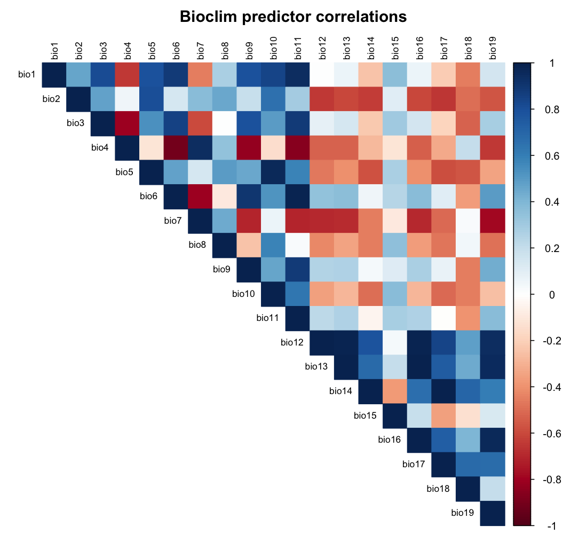
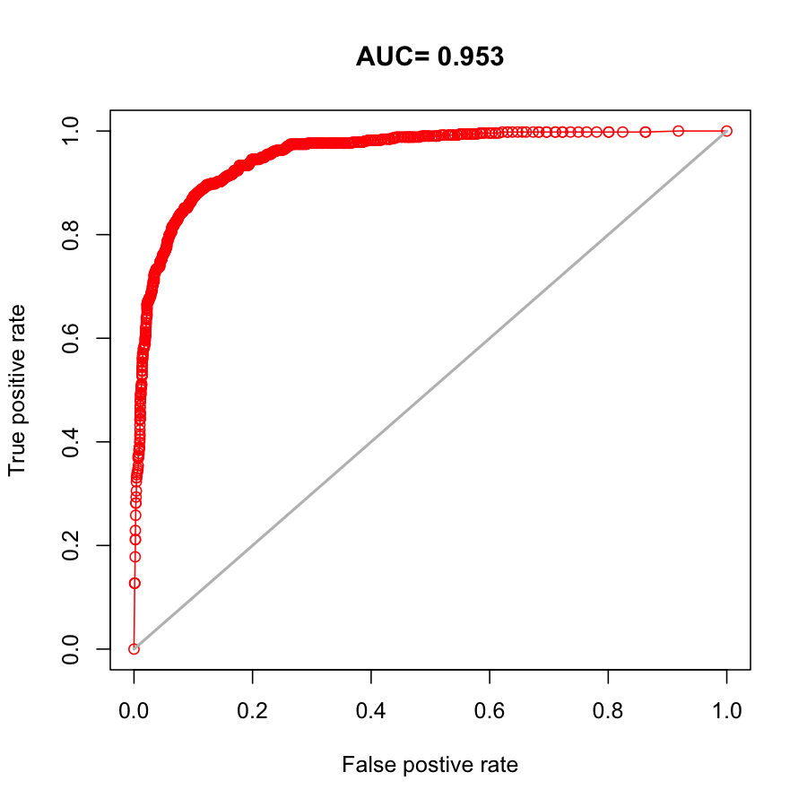
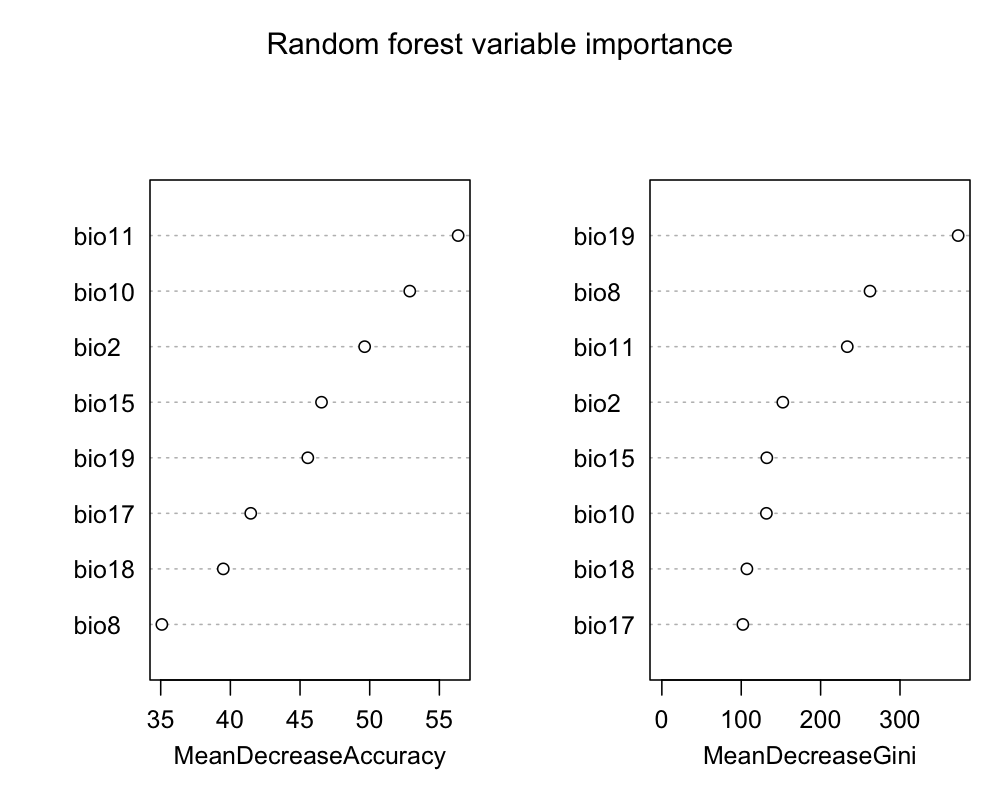
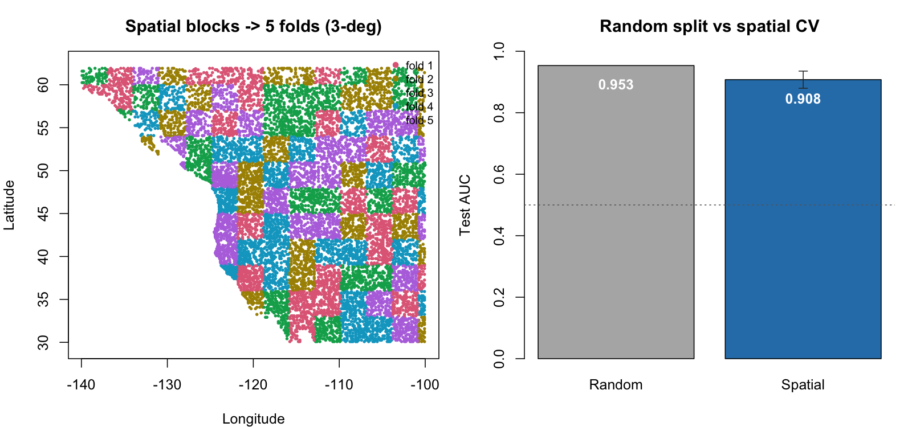
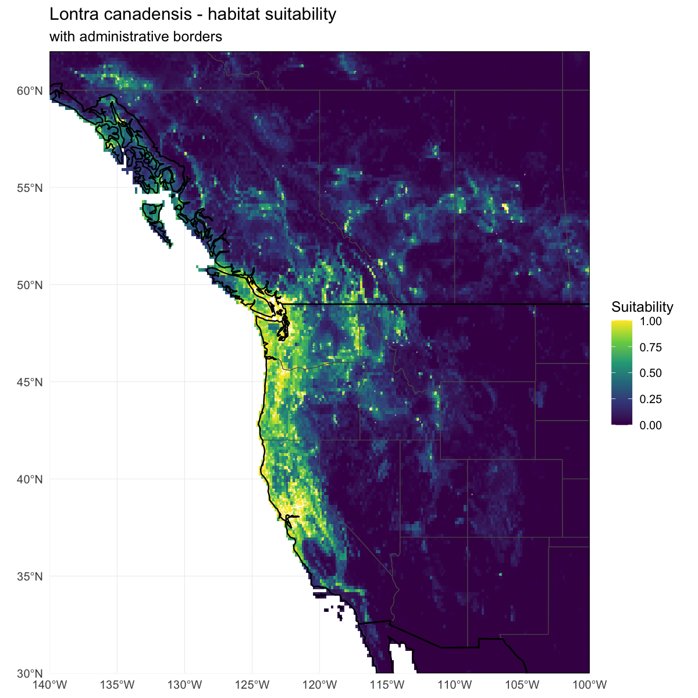
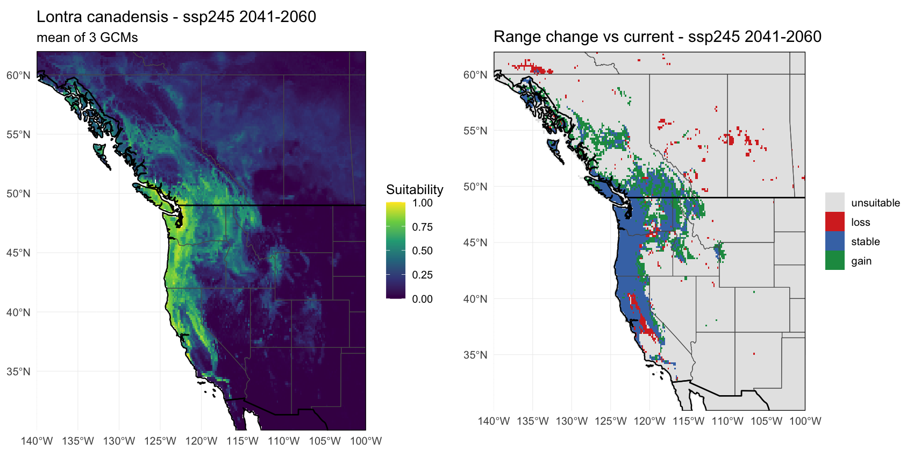

# Reading the output figures — a plain-language guide

Every time you run the pipeline it produces a set of images in
`outputs/figures/` (the example versions ship in `examples/`). This file
explains **what each image shows, how to read it, and what a "good" one
looks like** — written for someone new to biology and to modeling. No prior
experience with these plots is assumed; where a chart type is likely
unfamiliar (the AUC/ROC curve especially), it gets a from-scratch
explanation.

The figures are numbered by the pipeline step that makes them, so they also
tell the story of the analysis in order:

1. `01_occurrences_raw_vs_clean.png` — the sightings, before and after cleanup
2. `03_predictor_correlation.png` — which climate variables duplicate each other
3. `04_roc.png` — the model's report card (the AUC curve)
4. `04_variable_importance.png` — which climate variables mattered most
5. `<species>_04b_spatial_cv.png` — the *honest* report card (spatial cross-validation)
6. `05_suitability_map.png` — the main result: today's suitable habitat
7. `06_future_*.png` — where the suitable climate is projected to move

Two small spreadsheets accompany them — `<species>_evaluation.csv` and
`<species>_spatial_cv.csv` — and are explained alongside the figures they belong to.

Throughout, the numbers quoted are from the **river-otter example** so you
have something concrete to compare against; your own species will differ.

---

## 1. The sightings, cleaned up — `01_occurrences_raw_vs_clean.png`

**What it shows.** Two maps of the same thing: every place your species was
recorded. **Left ("Raw GBIF")** is the data exactly as downloaded. **Right
("Cleaned + thinned")** is what's left after the pipeline tidies it up. The
number in each title (`n = …`) is how many dots remain — for the otter,
8100 raw dropped to 2045 after cleaning.

**How to read it.** Look at the *density* of dots. On the raw map you'll
usually see dark blobs where dots pile on top of each other — these are
cities, roads, and popular parks, i.e. places lots of *people* go, not
necessarily places the species prefers. The cleaned map spreads the dots
out: the pipeline removes obvious junk (records at 0,0, in the ocean, or
with impossible coordinates) and then "thins" the rest, keeping only one
sighting within each small radius (5 km by default).

**What a good result looks like.** The right-hand map should still trace the
same overall shape as the left, but with the crowded blobs relaxed into a
more even scatter. If the right map is *nearly empty*, you thinned too
hard for how much data you have (turn `thin_dist_km` down), or the species
simply has few records. A big drop in count is normal and healthy — it
means the model will learn "where the species lives" instead of "where
people looked."

---

## 2. Which climate variables duplicate each other — `03_predictor_correlation.png`

**What it shows.** A **correlation heatmap** of the 19 standard climate
variables (bio1–bio19). Each little square answers: "when this variable is
high, does that other variable also tend to be high?" It's a grid of every
variable compared against every other.

**How to read the colors.** Read off the color scale on the right:
- **Dark blue (near +1):** the two variables move *together* — when one is
  high, so is the other. They carry nearly the same information.
- **Dark red (near −1):** they move in *opposite* directions — one high
  means the other low. That's also a tight relationship, just inverted.
- **White / pale (near 0):** the two are largely *unrelated* — each tells
  the model something the other doesn't.

The solid dark-blue diagonal is just every variable compared with itself
(always a perfect match) — ignore it.

**Why it matters.** All 19 variables are built from the same raw
temperature and rainfall data, so many are near-duplicates (notice the
blocks of blue among bio1–bio11, the temperature group, and again among
bio12–bio19, the rainfall group). Feeding a model several copies of
basically the same information doesn't help and can make it unstable. The
pipeline uses this relationship to **automatically drop** variables that
are too similar to one already kept (controlled by `cor_threshold`). This
figure is your look at *why* certain variables got dropped — the strong
blue and red patches are the redundancy being pruned away.

**What a good result looks like.** There's no "pass/fail" here — it's a
diagnostic. Lots of strong blue/red is *expected* with bioclim data and is
exactly what justifies pruning. If you hand-pick `bioclim_vars`, you can use
this plot to check that your chosen set isn't full of dark-blue duplicates.

---

## 3. The model's report card — `04_roc.png` (the AUC curve)

This is the plot you mentioned seeing once before — here's the from-scratch
version.

**The problem it solves.** After the model is trained, we need a single
honest answer to: "how well does it tell suitable places from unsuitable
ones?" The model doesn't output a flat yes/no; it outputs a *score* (a
suitability from 0 to 1). To turn scores into yes/no you have to pick a
cutoff — say, "call anything above 0.4 suitable." But which cutoff? The ROC
curve cleverly sidesteps that by testing *every possible cutoff at once*.

**The two axes (this is the key to reading it).**
- **Vertical — "True positive rate":** of the places the species really
  *was* found, what fraction did the model correctly flag as suitable?
  Higher is better. (Also called sensitivity — "did we catch the real
  sightings?")
- **Horizontal — "False positive rate":** of the places the species was
  *not* found, what fraction did the model wrongly flag as suitable?
  Lower is better. (These are false alarms.)

Each point on the red curve is one possible cutoff. Sliding along the curve
= trying stricter or looser cutoffs. A perfect model would shoot straight
up the left edge to the top-left corner: it catches *all* the real
sightings (top) while raising *zero* false alarms (left). So **the closer
the red curve hugs the top-left corner, the better.**

**The diagonal grey line** is the "no skill" baseline — what you'd get by
flipping a coin. A curve lying *on* the diagonal means the model is
worthless; a curve *bowing up toward the top-left* means it has real skill.

**AUC — the single number in the title.** AUC = "Area Under the Curve" —
literally the fraction of the square that sits *under* the red line. It
squeezes the whole curve into one score from 0.5 to 1.0:
- **0.5** = no better than a coin flip (curve on the diagonal).
- **~0.7** = fair.
- **~0.8** = good.
- **~0.9+** = excellent.
- **1.0** = perfect (and, honestly, a little suspicious — often a sign of a
  data problem rather than a miracle model).

A plain-English translation of AUC: *pick one real sighting and one random
non-sighting at random; AUC is the probability the model gives the real
sighting the higher suitability score.* The otter's **AUC = 0.953** means
it ranks a true otter spot above a random spot about 95% of the time —
strong discrimination, matching the curve's tight hug of the top-left
corner.

**Where the number is stored.** `<species>_evaluation.csv` holds the same figure in
table form — species, method, how many points were used to train
(`n_train`) and test (`n_test`), the `auc`, a correlation score (`cor`),
and `threshold_maxSSS`. That last one is the "best" single cutoff the
pipeline picks automatically (the value where the model best balances
catching real sightings against false alarms); step 05 uses it to decide
what counts as suitable on the maps.

> **The catch that motivates the next plot.** This grade uses a *random*
> split of the data — held-out test points sit right next to training
> points, so the model gets to "peek" at close neighbors. For clustered
> data (like the otter's, piled around cities) that flatters the score. The
> spatial-CV plot below is the tougher, more honest test.

---

## 4. Which climate variables mattered most — `04_variable_importance.png`

**What it shows.** After a random-forest model is trained, it can report
which predictors it leaned on most. This figure ranks them, most important
at the **top**. (It appears only when `method = "rf"`.)

**Why there are two panels.** They're two different ways of asking "how
important?", and they don't have to agree perfectly:
- **Left — "MeanDecreaseAccuracy":** how much *worse the model predicts*
  if you scramble that one variable. Big drop = the model really needed it.
  This is the more intuitive panel.
- **Right — "MeanDecreaseGini":** how much that variable helped the model's
  internal decision splits be "clean." A more technical measure of the same
  idea.

Read them as "which variables show up near the top of *both* panels" — for
the otter, bio11 (winter/coldest-quarter temperature), bio10 (summer
temperature), bio2 and bio19 sit high, telling a consistent story that
temperature seasonality drives where otters are.

**How to read the horizontal axis.** It's an importance score in the
method's own units — the *ranking and spacing* matter, not the absolute
number. A variable far to the right dominated; variables bunched together
contributed similarly.

**What a good result looks like.** Ideally the top variables make
biological sense for your species. If a variable you'd expect to matter
(say, rainfall for a wetland animal) sits at the bottom, that's worth a
pause — it might reflect the study region, the resolution, or that the
species is limited by something else. This plot is a conversation-starter,
not a verdict.

---

## 5. The honest report card — `<species>_04b_spatial_cv.png`

**What it shows.** This is the tougher grade promised above, in two panels.
- **Left — the fold map:** the study area is carved into large square
  blocks (3° ≈ 300 km here), and the blocks are dealt into groups called
  "folds," shown by color. The model is then trained on some folds and
  tested on *entirely different regions* it never saw — a real test of
  whether it travels to new places.
- **Right — the comparison bars:** the random-split AUC from step 04 (grey)
  next to the spatial-CV AUC (blue). The little error bar on the blue bar
  shows how much the score bounced around across folds. The dotted line at
  0.5 is the coin-flip baseline.

**How to read it.** The headline is the *gap between the two bars*. The
spatial bar is almost always **lower** than the random bar, because hiding
whole regions is harder than hiding scattered points. For the otter:
random **0.953** vs spatial **0.908 ± 0.028** — a modest gap, meaning the
model still does well when forced to predict new regions (its high grade
wasn't just an artifact of peeking at neighbors).

**What the gap tells you.**
- **Small gap (like the otter's):** the model genuinely generalizes; the
  optimistic grade was mostly earned.
- **Large gap (spatial bar much lower):** the random grade was flattering —
  the model was leaning heavily on geographic clustering and may not
  transfer well to new areas. Not a failure, but a caution about how much
  to trust predictions in places far from your data.

The per-fold numbers live in `<species>_spatial_cv.csv` (each fold's AUC, plus the
`spatial_mean`, its spread `spatial_sd`, and the `random_split` value for
comparison). This whole step is optional — toggle it with `run_spatial_cv`.

---

## 6. The main result: today's suitable habitat — `05_suitability_map.png`

**What it shows.** The payoff. The trained model is applied to every pixel
of the study area to paint a **suitability surface** — how climatically
suitable each spot is *right now*, on a 0-to-1 scale.

**How to read the colors** (the viridis scale, shown in the legend):
- **Bright yellow / green (near 1.0):** highly suitable — the climate here
  closely matches where the species is found.
- **Blue / teal (middle):** moderately suitable.
- **Dark purple (near 0):** unsuitable — climate unlike the species'
  known haunts.

For the otter, the bright ribbon runs down the Pacific coast and through
the valleys of Washington, Oregon, and California — exactly where you'd
expect a water-loving mammal — while the dry interior stays dark.

**The black and grey lines** are administrative borders (country lines in
black, state/province in grey), drawn so you can read a suitable patch
against the jurisdictions that manage it. Toggle them with the `borders_*`
settings.

**What a good result looks like.** The bright areas should overlap with
where your sightings actually were (compare to figure 1). Perfect overlap
isn't the goal — the model *should* also light up climatically-similar
places with few sightings (that's it being useful) — but if the bright
zones are nowhere near your dots, something upstream needs attention.

> **A caution about the bright edges.** The map can glow brightest at the
> warm/dry southern edge of the range. That's partly a modeling artifact:
> the model has never seen the species in hotter conditions, so it
> confidently (over)predicts there. Read the *pattern*, not individual
> dazzling pixels.

---

## 7. Where the climate is projected to move — `06_future_*.png`

**What it shows.** One image per future time window (the example ships
`2041-2060` and `2081-2100`). The model, trained on today's climate, is
re-drawn onto *future* climate. Each image has two panels:

- **Left — future suitability:** the same yellow-to-purple suitability map
  as figure 6, but for the future climate. The subtitle ("mean of 3 GCMs")
  is a reminder that this is an *ensemble* — the average of several climate
  models, which is more trustworthy than betting on one.
- **Right — range change:** the genuinely useful part. It compares future
  suitable-vs-not against today's, and colors every pixel by what happened:
  - **Blue "stable":** suitable now *and* in the future — the refuges.
  - **Red "loss":** suitable now but *not* in the future — projected to
    drop out.
  - **Green "gain":** *not* suitable now but suitable in the future — new
    ground opening up (often poleward or upslope).
  - **Grey "unsuitable":** not suitable in either period — irrelevant to
    this species.

**How to read it.** Look at the balance of red vs green, and *where* each
sits. For the otter under the moderate SSP2-4.5 scenario, mid-century shows
large blue stable cores along the coast, some green gains pushing north and
inland, and scattered red losses at the warm southern and dry inland
margins — a range *shifting and reshuffling* more than collapsing.

**What drives how bleak or rosy this looks.** Almost everything about these
maps is set by three config knobs — the emissions scenario (`future_ssp`),
which climate model(s) you average (`future_gcm`), and the time window
(`future_periods`). A high-emissions worst-case scenario with a
hot-running single model will look far grimmer than a moderate scenario
averaged over several models. This is exactly why two people can "model the
same species" and reach opposite conclusions — see `CONFIG.md` for the full
walkthrough, and always change *one* of these knobs at a time when
comparing.

**A modeling caveat to keep in mind.** The model can only describe climates
like those it was trained on. Where future climate has *no present-day
analog* (genuinely novel conditions), different methods behave differently —
random forests tend to flatten out, other methods can crash toward zero — so
treat the far-future, far-from-anything-seen pixels as the least certain
part of the map.

---

## Quick reference: what each figure answers

| Figure | The question it answers |
|--------|-------------------------|
| `01_occurrences_raw_vs_clean` | Where was the species seen, and did cleanup work? |
| `03_predictor_correlation` | Which climate variables duplicate each other? |
| `04_roc` | How well does the model tell suitable from unsuitable? (AUC) |
| `04_variable_importance` | Which climate variables did the model rely on? |
| `04b_spatial_cv` | Does the model still do well on *new regions*? (honest AUC) |
| `05_suitability_map` | Where is suitable habitat **today**? |
| `06_future_*` | Where is suitable climate projected to **move**? |

For what controls each of these — and how turning a knob changes the
picture — see **[`CONFIG.md`](CONFIG.md)**.
