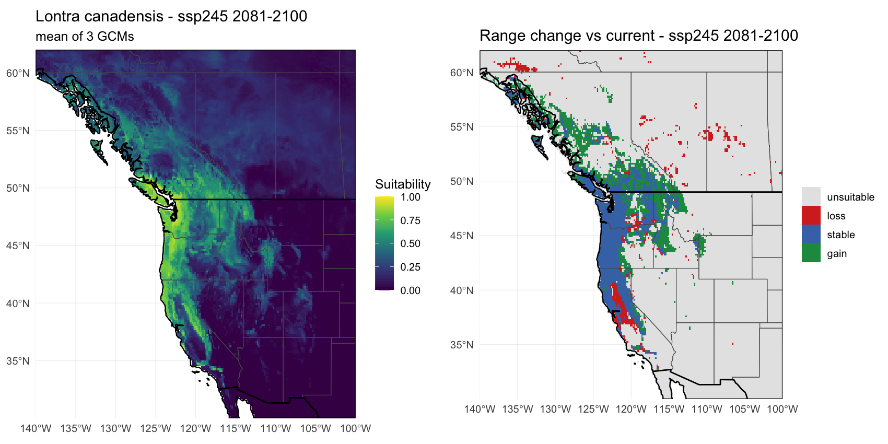

# Reproducible Species Distribution Model (SDM) Template

A small, config-driven pipeline for fitting a correlative species
distribution model from open data. Built for teaching and for getting a
defensible first model quickly — every step is a separate, readable R
script that can be run on its own or as part of the whole pipeline.

**Worked example:** North American river otter (*Lontra canadensis*)
across western North America. Swap the species in one line (`R/config.R`).

---

## Example output

The template ships with the outputs of a verified river otter run (10
arc-minute resolution, random forest) under [`examples/`](examples/). For a
**plain-language walkthrough of every figure** — how to read it, what a good
one looks like, and a from-scratch explanation of the AUC/ROC plot — see
**[`OUTPUTS.md`](OUTPUTS.md)**.


Predicted suitability is highest along the Pacific coast and the river
valleys of the Northwest. Note the strong observation-bias signal: otter
records concentrate where people are (the Willamette Valley, Puget Sound,
the Bay Area), so the map partly reflects *where otters get reported* as
much as where they can live — a useful classroom discussion point.
Held-out performance for this run:

| Metric | Value |
|--------|-------|
| Test AUC | 0.953 |
| Test correlation | 0.747 |
| Max-SSS threshold | 0.402 |
| Predictors retained | 8 of 19 (|r| > 0.7 pruned) |

> These are presence-vs-background metrics on a random split — read the
> [caveats](#method-notes--caveats) before quoting them. Bioclim
> predictors describe *climate*, not rivers or wetlands, so for a
> water-linked mammal like the otter the model is genuinely a coarse
> climate-envelope proxy — another honest teaching moment.

**How honest is that AUC? — spatial cross-validation (step 04b).** The
0.953 above comes from a *random* train/test split, where held-out points
sit right next to training points and the model gets to peek at
neighbours. Step 04b instead lays a grid of square blocks over the map,
deals whole blocks into folds, and holds out *entire regions* at a time —
a harder, more honest test of whether the model transfers to places it
has never seen.


| Evaluation | Test AUC |
|------------|----------|
| Random split (step 04) | 0.953 |
| Spatial block CV (step 04b, 5 folds, 3° blocks) | 0.908 ± 0.028 |

The spatially-blocked AUC is **lower** — that drop is the whole lesson.
The model is a little more optimistic than it should be when you let it
peek at nearby points; asked to predict genuinely new regions, it does
somewhat worse. (The gap is modest here because the otter data spans many
well-separated blocks; for a species known from a few tight clusters the
gap is often dramatic.) Toggle it with `run_spatial_cv` in the config and
tune the difficulty with `spatial_block_deg` (bigger blocks = harder
test) and `spatial_cv_k`.

And the future projection (step 6) — 3-GCM ensemble, SSP2-4.5, end of
century — showing where that same climate niche is projected to move:



Gains (green) appear inland and to the north; losses (red) at the warm,
dry southern margin of the modeled niche — the fingerprint of
climate-driven range shift.

---

## What it does

1. **Occurrences** — downloads georeferenced records from **GBIF** (REST
   API, no heavy packages) and cleans them with explicit, inspectable
   rules (range checks, null-island, integer-degree, uncertainty,
   fossil/unknown basis, spatial thinning).
2. **Predictors** — downloads **WorldClim 2.1** bioclimatic variables
   (19 layers) by direct download and crops them to the study region.
3. **Prepare** — extracts predictor values at presence + background
   points, prunes collinear predictors (|r| > threshold), and makes a
   stratified train/test split.
4. **Fit & evaluate** — fits a down-sampled random forest (or logistic
   GLM), evaluates on held-out data (AUC, correlation, max-SSS
   threshold), and plots ROC + variable importance.
   *(4b, optional)* **Spatial cross-validation** — re-scores the model
   with spatially-blocked folds (holds out whole regions) for an honest,
   less optimistic AUC. Toggle with `run_spatial_cv`.
5. **Project (current)** — predicts habitat suitability across the
   region, writes a continuous suitability raster and a binary presence
   raster, and draws the map.
6. **Project (future, CMIP6)** — takes the *same fitted model* and
   projects it onto downscaled **CMIP6 future climate** for one or more
   time periods, builds a **multi-model ensemble**, and draws a
   **range-change map** (gain / loss / stable) versus the current
   distribution. See [Projecting to future climate](#projecting-to-future-climate).

---

## Setup — install the packages

Pick **one** of these. They install the same seven R packages; they
differ only in *how*. If you're on Posit Cloud or any plain R install,
use Option A — it needs no conda.

### Option A — native R (Posit Cloud, RStudio Desktop, HPC R module)

```r
# From the project root, in R (or: Rscript install.R)
source("install.R")
```

`install.R` uses R's own `install.packages()`. On Posit Cloud this pulls
**precompiled binaries** from the Posit Public Package Manager (the
default there), so it's fast and needs no compiler. The script installs
only what's missing and then checks that every package loads.

> **System libraries.** `terra` and `sf` sit on GDAL, GEOS and PROJ.
> Posit Cloud and most RStudio Server images already have these. If a
> build fails on a machine you control, install them once at the OS level
> (the script prints the exact command for Ubuntu, macOS, or an HPC
> module) and re-run.

### Option B — conda (HPC, or if you already use conda)

```bash
conda env create -f environment.yml   # creates env "sdm"
conda activate sdm
```

Versions are pinned to the set this template was verified with.

### Option C — renv (optional, exact version locking for a class)

If you want every student to get the **exact same** package versions,
this repo ships a ready-made [`renv`](https://rstudio.github.io/renv/)
lockfile (`renv.lock`) — Posit's native reproducibility tool, the
parallel to conda's version pins but pure R:

```r
install.packages("renv")
renv::restore()   # reads renv.lock, installs those exact versions
```

`renv.lock` records all 25 packages (the 7 direct + their dependencies)
at the versions this template was verified with, R 4.5.3.

**Does this conflict with Options A and B? No — it's opt-in.** The repo
contains *only* the `renv.lock` file, which is inert: nothing reads it
unless you personally run `renv::restore()`. There is deliberately no
`.Rprofile` or `renv/` auto-activation folder, so the project does **not**
silently switch anyone into an renv sandbox. A student using `install.R`
or conda is completely unaffected by the lockfile's presence. Opt in only
if you want the version locking.

> **Regenerating the lock.** After changing package versions, run
> `renv::init()` then `renv::snapshot()` to refresh `renv.lock`. If you do
> this, delete the `.Rprofile` and `renv/` folder that `init()` creates
> before committing, to keep the lockfile opt-in as above.

---

## Quick start

```bash
# From the project root, after setup (Option A/B/C above):
Rscript run_all.R
```

Or, interactively (good for teaching — inspect objects between steps):

```r
source("R/config.R")
source("R/01_get_occurrences.R")
source("R/02_get_predictors.R")
source("R/03_prepare_data.R")
source("R/04_fit_model.R")
source("R/05_predict_map.R")
source("R/06_project_future.R")   # future climate (optional)
```

---

## Configure it (`R/config.R`)

Everything is set in one file. The table below is the quick reference; for a
**plain-language explanation of every knob** — what each value does, and what
you gain or give up when you turn it one way versus the other — see
**[`CONFIG.md`](CONFIG.md)**. It's written for readers new to biology and
modeling, and it explains the "turn one knob at a time" habit that keeps your
comparisons meaningful.

The most common edits:

| Knob | What it controls |
|------|------------------|
| `species_name` / `species_short` | Which species (must match GBIF backbone) |
| `extent` | Study-region bounding box (lon/lat); `NULL` = use occurrence extent |
| `worldclim_res` | Climate resolution in arc-minutes: `"10"` (fast/teaching) → `"0.5"` (fine) |
| `bioclim_vars` | Which of bio1–bio19 to consider |
| `cor_threshold` | Collinearity cutoff for predictor pruning |
| `n_background` | Number of background / pseudo-absence points |
| `thin_dist_km` | Spatial thinning distance |
| `method` | `"rf"` (random forest) or `"glm"` |
| `run_spatial_cv` | `TRUE`/`FALSE` — run step 04b (spatially-blocked CV) |
| `spatial_block_deg` | Block size in degrees (bigger = harder test) |
| `spatial_cv_k` | Number of spatial folds |
| `future_gcm` | Which CMIP6 climate model(s); a vector = ensemble |
| `future_ssp` | Emissions scenario (`"ssp126"`…`"ssp585"`) |
| `future_periods` | Which 20-year future window(s) |
| `borders_state` | `TRUE`/`FALSE` — draw state / province lines on maps |
| `borders_country` | `TRUE`/`FALSE` — draw country outlines on maps |
| `borders_scale` | Border detail: `"50m"` (default) or `"10m"` (finer) |
| `seed` | Reproducibility |

To model a different species, change only `species_name`, `species_short`,
and (optionally) `extent`, then re-run. To change the future scenario,
edit the three `future_*` knobs — see the next section for what they mean.

---

## Projecting to future climate

Step 6 answers a different question from steps 1–5. Steps 1–5 ask *where
does this species live under today's climate?* Step 6 asks *where would
that same climatic niche be found under a projected future climate?*

**Key idea: the model is not retrained.** We fit the species–climate
relationship once, on current climate (steps 1–4). Step 6 keeps that
fitted model and simply feeds it a *different set of climate maps* —
downscaled projections of what the 19 bioclim variables look like in,
say, 2041–2060. The output is where the species' current climatic
niche will exist in the future. (This is a correlative projection; it
assumes the niche itself doesn't evolve and ignores dispersal limits,
biotic interactions, and land-use change — standard caveats for this
class of model.)

There are three things to choose, all in `R/config.R`.

### 1. `future_ssp` — the emissions scenario ("how much warming?")

**SSPs** (Shared Socioeconomic Pathways) are storylines about how much
greenhouse gas humanity emits this century. Higher number = more warming.

| SSP | Story, in one line | ~Warming by 2100 |
|-----|--------------------|------------------|
| `ssp126` | Strong climate action; emissions fall fast | ~1.8 °C (near Paris target) |
| `ssp245` | "Middle of the road"; current-ish policies | ~2.7 °C |
| `ssp370` | Regional rivalry; emissions keep rising | ~3.6 °C |
| `ssp585` | Fossil-fuel-intensive; the high-end scenario | ~4.4 °C |

**Which to pick?** `ssp245` is the sensible default for a realistic
central case, and it's what this template ships with. Teaching the
*range* of futures is often more valuable than one number — running
`ssp126` **and** `ssp585` brackets the optimistic and pessimistic ends
and makes a great classroom comparison.

### 2. `future_gcm` — the climate model(s) ("whose forecast?")

A **GCM** (Global Climate Model) is one research group's physical
simulation of the climate system. Different groups make different
modelling choices, so for the *same* SSP they disagree — especially about
rainfall and about specific regions. That disagreement is real
uncertainty, not error, and good practice is to show it rather than hide
it behind a single model.

This template lets you pass **a vector of GCMs** and it builds an
**ensemble**: it runs each one, then reports

- **mean suitability** across the GCMs (the projection), and
- **agreement** — how many GCMs call each cell suitable (the confidence).
  A cell where all 3 agree is a robust prediction; a cell where they
  split is genuinely uncertain.

The default uses three well-established GCMs
(`MPI-ESM1-2-HR`, `MRI-ESM2-0`, `EC-Earth3-Veg`). WorldClim hosts ~24;
using one is faster but overstates certainty, so a small ensemble (3–5)
is the recommended teaching default. Any GCM name from the
[WorldClim 2.1 CMIP6 list](https://www.worldclim.org/data/cmip6/cmip6climate.html)
works.

### 3. `future_periods` — the time window ("how far ahead?")

Downscaled climate is provided in 20-year averages. Pick one or more:

| Period | Roughly |
|--------|---------|
| `2021-2040` | Near term |
| `2041-2060` | Mid-century (common planning horizon) |
| `2061-2080` | Late century |
| `2081-2100` | End of century (largest signal) |

The template default runs **`2041-2060`** and **`2081-2100`** so you can
see the shift accelerate over time.

### Reading the change map

For each period the ensemble produces a four-colour map versus the
current distribution:

- **stable** (blue) — suitable now *and* in the future (climate refugia)
- **loss** (red) — suitable now, not in the future (contraction)
- **gain** (green) — not suitable now, suitable in the future (expansion)
- **unsuitable** (grey) — neither

For most temperate species you'll see gains toward the poles and higher
elevations and losses at the warm, dry trailing edge — the fingerprint
of climate-driven range shift.

> **Cost note.** Each GCM × period is a separate ~50–120 MB download
> (cached after first use). Three GCMs × two periods = six downloads.
> Drop to one GCM or one period for a quick look; downloads are reused on
> re-runs.

---

## Administrative borders (for assessment context)

Species distribution models often feed a **Species Assessment** — the kind
of analysis a management agency (e.g. US Fish & Wildlife Service, a state
department of natural resources, a provincial ministry) uses to weigh a
decision: *should a road go here? will this activity affect the species?*
For that, a suitability surface is far more useful with **jurisdictional
boundaries** drawn on it — you can see at a glance that a suitable patch
straddles the Oregon/Washington line (two state agencies are
stakeholders), or crosses into British Columbia (an international
population).

The maps in steps 05 and 06 are drawn with **ggplot2** and can overlay
borders from [Natural Earth](https://www.naturalearthdata.com/) (public
domain). Two independent switches in `R/config.R`:

```r
borders_state   = TRUE,    # state / province lines (US, Canada, Mexico)
borders_country = TRUE,    # country outlines
borders_scale   = "50m",   # "50m" (default) or "10m" (finer coastlines)
```

Set either to `FALSE` to omit that layer; set both to `FALSE` for a plain
suitability surface. The `admin_1` layer covers **US states, Canadian
provinces, and Mexican states** in one file, so the whole western-North-
America extent is labelled consistently.

**How it's fetched.** Borders download once from Natural Earth's public
GitHub mirror and are cached under `data/raw/natural_earth/` — the same
direct-download approach the template uses for GBIF and WorldClim, so no
extra R packages beyond `ggplot2`. If the download can't complete (e.g.
offline), the maps **still render without borders** and print a notice,
rather than stopping the pipeline.

> **Swapping regions.** Because borders are cropped to your `extent`, the
> same switches work for any study area — model a species in the
> Appalachians or the Alps and the relevant states/countries appear
> automatically.

---

## Outputs

```
data/processed/
  <species>_occ_clean.csv     cleaned presence coordinates
  <species>_predictors.tif    cropped bioclim stack
  <species>_model_data.rds    train/test tables + retained predictors
outputs/
  <species>_suitability.tif   continuous habitat suitability (0–1)
  <species>_presence.tif      binary presence at max-SSS threshold
  models/
    <species>_model.rds       fitted model object
    <species>_evaluation.csv  AUC, correlation, threshold (random split)
    <species>_spatial_cv.csv  per-fold + mean AUC (spatial CV, step 04b)
  future/                                  (step 06)
    <species>_<ssp>_<period>_suitability.tif  ensemble-mean future suitability
    <species>_<ssp>_<period>_agreement.tif    # GCMs agreeing (0..n)
    <species>_<ssp>_<period>_change.tif       loss/stable/gain classes
  figures/
    <species>_01_occurrences_raw_vs_clean.png
    <species>_03_predictor_correlation.png
    <species>_04_roc.png
    <species>_04_variable_importance.png
    <species>_04b_spatial_cv.png              fold map + random-vs-spatial AUC
    <species>_05_suitability_map.png
    <species>_06_future_<ssp>_<period>.png    future suitability + change map
```

---

## Method notes & caveats

- **Background, not true absence.** GBIF gives presence-only data; we
  draw random background points. AUC is therefore presence-vs-background
  discrimination, not presence-vs-absence — interpret accordingly.
- **Sampling bias.** GBIF records are spatially biased toward roads,
  cities, and well-surveyed regions. Spatial thinning mitigates but does
  not remove this. For publication, consider a target-group background
  or bias layer.
- **Random split vs. spatial CV.** The headline AUC in `<species>_evaluation.csv`
  comes from a *random* train/test split. Because occurrences are
  spatially autocorrelated, that number is optimistic — treat it as an
  upper bound. Step 04b (`run_spatial_cv`) reports the spatially-blocked
  AUC, which holds out whole regions and is the more honest figure to
  quote. Use the two together: the gap between them is itself a diagnostic
  of how much the model is leaning on spatial clustering.
- **Collinearity pruning is greedy** and based on Pearson |r| only;
  consider VIF for a more principled selection.
- **Future projections are correlative.** Step 06 assumes the species'
  climatic niche is fixed (no evolution) and does not model dispersal,
  biotic interactions, or land-use change — so a "gain" cell means
  *climatically suitable*, not *reachable or occupied*. Show the GCM
  ensemble spread rather than a single model, and read future maps as
  scenarios, not predictions.

---

## Dependencies

R packages: `terra`, `predicts`, `randomForest`, `sf`, `corrplot`,
`ggplot2`, `httr`, `jsonlite`. Install them with **`install.R`** (native R,
no conda), **`environment.yml`** (conda), or **`renv`** —
see [Setup](#setup--install-the-packages). GBIF, WorldClim, and Natural
Earth borders are all accessed by direct download, so no API wrapper
packages are required.

System libraries (for `terra`/`sf`): GDAL, GEOS, PROJ — preinstalled on
Posit Cloud and most RStudio Server images.

Data sources: [GBIF](https://www.gbif.org) (occurrences),
[WorldClim 2.1](https://www.worldclim.org) (climate),
[Natural Earth](https://www.naturalearthdata.com/) (administrative borders).
